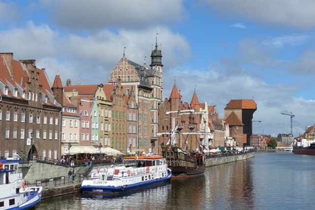
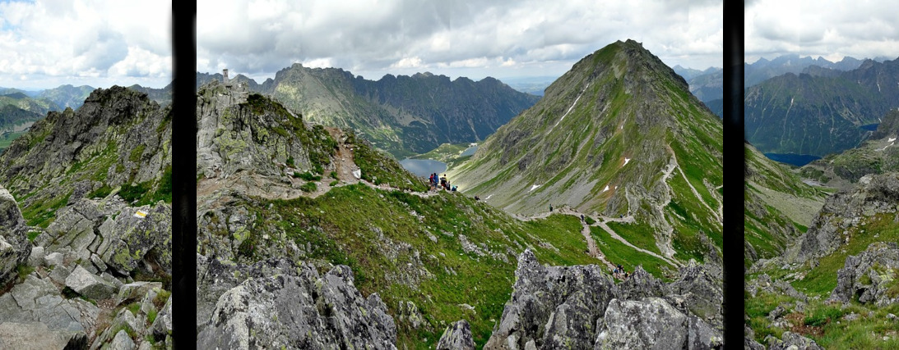

# Scenariusz Przygotowujący do Egzaminu INF.03 (Arkusz 09 - Czerwiec 2024 / JS) – Wersja Akademicka

Niniejszy dokument to zaawansowany przewodnik dydaktyczny, skonstruowany według profesjonalnych wzorców przygotowujących do części praktycznej egzaminu potwierdzającego kwalifikacje zawodowe (INF.03). Analizowany arkusz (09 / Galeria zdjęć) skupia się na logice klienckiej (Frontend: HTML, CSS, JavaScript) oraz operacjach bazodanowych wykonywanych na serwerze zrzutami ekranu.

Metodyka przyjęta w scenariuszu zakłada wykorzystanie technik ewaluacji oprogramowania: **Szablony Bazowe**, **Testowanie Wstępne**, **Analiza Usterek (Debugowanie)**, **Wykorzystywanie Logów Przeglądarki** oraz inżynieryjne **Alternatywy Technologiczne**.

---

## KROK 1: Inicjalizacja Środowiska, Baza Danych oraz "Szablon Bazowy" (Boilerplate)

W pierwszej kolejności priorytetem jest zabezpieczenie punktów za konfigurację środowiska oraz sprawnie przeprowadzone zapytania SQL, co odblokowuje czas na logikę aplikacyjną.

1. W dedykowanym katalogu (np. `C:\xampp\htdocs\numer_pesel`) należy utworzyć zbiór pustych przestrzeni dyskowych wskazanych specyfikacją: `galeria.html`, `styl.css` oraz `skrypt.js`.
2. Do pliku `galeria.html` wprowadzamy znormalizowany szablon kodu w standardzie HTML5 (Boilerplate). Ponieważ główna specyfikacja nakazuje wykonanie czystego pliku HTML (bez wykorzystania protokołu backendowego PHP do wyświetlania bazy), Szablon Bazowy skupia się na bezbłędnym załączeniu zasobów.

**Szablon bazowy aplikacji Frontendowej:**

```html
<!DOCTYPE html>
<html lang="pl">
  <head>
    <meta charset="UTF-8" />
    <title>Biuro turystyczne</title>
    <!-- Zabezpieczenie integralności kaskadowych arkuszy stylów -->
    <link rel="stylesheet" href="styl.css" />
  </head>
  <body>
    <!-- Miejsce na strukturę DOM widoku -->

    <!-- Konieczna inkluzja skryptu na samym dnie dokumentu (przed zamknięciem body), by DOM został całkowicie zaprezentowany dla skryptów parsowania -->
    <script src="skrypt.js"></script>
  </body>
</html>
```

### Operacje SQL i Dekonstrukcja Zarządzania Danymi (`phpMyAdmin`)

Należy zasilić narzędzie `phpMyAdmin` strukturą pobraną z archiwum (`wycieczki.sql`) dla nowo utworzonej bazy `wycieczki` (kodowanie `utf8_unicode_ci`). Egzamin wymaga zrzutów ekranu następujących zapytań (zapisz testy w pliku `kwerendy.txt`):

- **Kwerenda 1:** Wybierająca jedynie miejsce i liczbę dni dla wycieczek, których cena jest mniejsza od 1000 zł.
  - `SELECT miejsce, liczbaDni FROM wycieczki WHERE cena < 1000;`
- **Kwerenda 2:** Licząca średnią cenę dla wycieczek pogrupowanych ze względu na liczbę dni (alias kolumny "sredniaCena").
  - `SELECT liczbaDni, AVG(cena) AS "sredniaCena" FROM wycieczki GROUP BY liczbaDni;`
  - _Uzasadnienie metodyczne:_ Weryfikacja umiejętności wykorzystania wbudowanej funkcji agregującej `AVG()` z obligatoryjną dla niej klauzulą wymuszaną zgrupowanym wskaźnikiem `GROUP BY`.
- **Kwerenda 3:** Wybierająca jedynie miejsce wycieczki i odpowiadającą mu nazwę zdjęcia dla wycieczek, których cena jest wyższa od 500 zł (Relacja).
  - `SELECT w.miejsce, z.nazwa FROM wycieczki w JOIN zdjecia z ON w.id = z.Wycieczki_id WHERE w.cena > 500;`
- **Kwerenda 4:** Tworząca wirtualnego użytkownika "Ewa".
  - `CREATE USER 'Ewa'@'localhost' IDENTIFIED BY 'Ewa!Ewa';`

---

## KROK 2: Logika Interfejsu (HTML) oraz Testy Wstępne Integracji skryptowych

Rozpoczynamy budowę zagnieżdżonych warstw HTML zgodnie ze specyfikacją ("baner, lewy, środkowy, prawy, miniatury i stopka"), stosując semantyczne modyfikatory języka HTML5 w pliku `galeria.html`:

```html
<header id="baner">
  <h1>Zwiedzamy Polskę</h1>
</header>

<nav id="lewy">
  <!-- Przycisk Poprzednie zdjęcie, uwaga encja dla "mniejszości" to &lt; -->
  <button onclick="poprzednie()">&lt;</button>
</nav>
<main id="srodkowy">
  
</main>
<aside id="prawy">
  <!-- Przycisk Następne zdjęcie, uwaga encja dla "większości" to &gt; -->
  <button onclick="nastepne()">&gt;</button>
</aside>

<section id="miniatur">
  
  
  
  
  
  
  
</section>

<footer id="stopki">
  <h3>Autorem galerii jest:</h3>
  <p>NUMER PESEL_KANDYDATA</p>
  <a href="http://pixabay.com" target="_blank">Więcej zdjęć</a>
</footer>
```

### 🔬 Testowanie Wstępne (Zwinny Rozwój Modułów JavaScript)

Zanim uczeń przystąpi do pisania pełnego algorytmu powiększającego grafiki, należy udowodnić integralność powiązań HTML->JavaScript.

1. Odkoduj najmniejszą przestrzeń logiczną. Otwórz plik `skrypt.js`.
2. Napisz testy jednostkowe asertywne sprawdzające reakcję:

```javascript
function poprzednie() {
  alert("Test: Moduł Poprzednie połączony");
}
function nastepne() {
  console.log("Test: Moduł Następne gotowy do zasilenia logiką");
}
```

_Uzasadnienie:_ Ujawnienie ramki pop-up `alert()` po kliknięciu udowadnia poprawne wpisanie komendy `onclick` w przycisku oraz właściwe wciągnięcie skryptu na dnie pliku `galeria.html`. Chroni to kandydata przed szukaniem na oślep błędu algorytmicznego, upewniając go co do działania strumieni komunikacyjnych.

---

## KROK 3: Określanie Reguł Przestrzennych CSS oraz Analiza Usterek Układu CKE

Specyfikacja arkusza ustala skomplikowany, horyzontalny przepływ bloków dla centrum strony: `lewy` (15%), `środkowy` (70%), `prawy` (15%). Po przeniesieniu tego na właściwości `float` powstanie istotny kolaps struktury HTML z dolnymi blokami.

### 🔥 Analiza Usterki Przestrzennej ("Trening Błędów")

Gdy aplikant sklasyfikuje w CSS reguły opływania poziomego i zachowa plik bez weryfikacji warstw, sekcja `miniatur` oraz stopka gwałtownie "wbiją się" w środek ekranu pomiędzy zdjęcia w wyniku zawieszenia wyższych partii (anomalia _collapsing parent_).

- **Procedura ewaluacji logiczna:** Deklaracja `float: left` nakazuje blokowi zrezygnować z płaskiej warstwy blokowej (Block Formatting Context) układu, "fruwając" wokół otoczenia.
- **Rozwiązanie korekcyjne:** Należy na następnym strukturalnie bloku niższym (`id="miniatur"`) nałożyć inżynieryjną, wymuszającą kaskadę regułę czyszczącą: `clear: both;`.

**Pełna i właściwa reprezentacja pliku `styl.css` z usunięciem anomalii:**

```css
/* Definicje wspólne ogólne */
body,
* {
  font-family: "Georgia", serif;
  color: white;
}

/* Grupowanie formatów - zastosowanie bez powielania własności */
#baner,
#stopki {
  background-color: Maroon;
  text-align: center;
  padding: 2px;
}
/* Bezwzględne zerowanie błędów Float Leftu przy blokach lewy, srodkowy, prawy! */
#miniatur {
  background-color: Maroon;
  height: 70px;
  clear: both; /* Instrument wymuszający zakończenie mechanizmu opływania na sąsiednich kontenerach! */
}

/* Modelowanie środkowego korytarza Layoutu z float */
#lewy,
#srodkowy,
#prawy {
  background-color: LightSalmon;
  height: 527px;
  float: left;
}
#lewy,
#prawy {
  width: 15%;
}
#srodkowy {
  width: 70%;
}

/* Specyfikacje przycisków w blokach lewy/prawy wg polecenia */
button {
  background-color: LightSalmon;
  color: Maroon;
  border: none;
  font-size: 400%;
  display: block;
  margin: 0 auto; /* wyśrodkowanie marginesów automat. */
  margin-top: 210px; /* padding-top/margin-top */
}

/* Animacje bloków i obrazów miniaturowych wywołane wg Tabeli 3 */
#srodkowy img {
  display: block;
  margin: 0 auto;
  margin-top: 45px;
  transform: scale(1);
  transition: transform 5s; /* Animacja Przejściowa CSS */
}
#srodkowy img:hover {
  transform: scale(1.2); /* 120% */
}

#miniatur img {
  height: 70px;
  margin-left: 0px;
  animation: suwak 4s ease-out; /* Animacja Klatkowa wg Keyframes */
}

@keyframes suwak {
  0% {
    margin-left: 50px;
  }
  100% {
    margin-left: 0px;
  }
}
```

> [!TIP]
> **[Zalecana Alternatywa Nowoczesna] Moduł układu elastycznego CSS Flexbox:**
> W modelu architektury współczesnej stanowczo odrzuca się pozycjonowanie typu `float`, ponieważ powoduje trudne do przewidzenia kolizje warstw DOM (brak odziedziczonego poziomu Y). Zaleca się zgrupowanie lewej, środkowej i prawej kolumny pod obiektem klasy tzw. _wrappera_ i nadanie mu propercji `display: flex;`. Skutkuje to zautomatyzowanym wyrównaniem dzieci układu poziomo bez obawy przemieszczenia pionowych struktur takich jak sekcja mini, bez utylizacji narzutu `clear: both`.

---

## KROK 4: Implementacja Skryptowa oraz Algorytmika Zmiany Obrazu (JS)

Logika biznesowa zadania polega na śledzeniu stanu aktywnie ładowanej klatki zdjęcia (od 1 do 7), podmieniając dynamicznie atrybut obiektu DOM.

### 🗺 Mapy Myśli Algorytmicznych

Tworzymy deklaratywną specyfikację problemu jako zdefiniowane w komentarzach mikrokroki, w celu zachowania kognitywnego chłodu kursanta.

```javascript
/* MAPA LOGICZNO-BIZNESOWA SKRYPTU
    Cel główny: Kontrola suwaka nad atrybutami 
    Stan bazowy: Deklarujemy w module pamięci JS aktualny Numer zdjęcia, domyślnie = 1.
    
    Funkcja Następne():
    1. Obierz warunek sprawdzający - czy Numer == 7? Jeśli tak, natychmiast narzuć Numer = 1, aby zresetować pętlę do przodu.
    2. Jeśli nie (else) -> Bez wahania zinkrementuj Numer (dodaj 1).
    3. Przekaż nowo ustalony ciąg "nr.jpg" w element DOCELOWY z HTML.
    
    Funkcja Poprzednie():
    1. Obierz warunek sprawdzający graniczny - czy Numer == 1? Jeśli tak, zresetuj uderzając w dno bazy, czyli Numer = 7.
    2. W innym scenariuszu - dekrementuj zmienną Numer (odejmij 1).
    3. Przypisz wstaw ścieżkę do elementu DOCELOWEGO HTML.
*/
```

### Kod Logiczny Javascript

```javascript
let aktualneZdjecie = 1; // Pamięć podręczna modułu

function nastepne() {
  if (aktualneZdjecie === 7) {
    aktualneZdjecie = 1;
  } else {
    aktualneZdjecie++;
  }
  document.getElementById("glowneZdjece").src = aktualneZdjecie + ".jpg";
}

function poprzednie() {
  if (aktualneZdjecie === 1) {
    aktualneZdjecie = 7;
  } else {
    aktualneZdjecie--;
  }
  document.getElementById("glowneZdjece").src = aktualneZdjecie + ".jpg";
}
```

### 🧰 Zastosowanie Narzędzi Deweloperskich (Analiza Wewnątrz Operacyjna - F12)

Wszelkie potknięcia podczas alokowania modelu DOM w języku skryptowym owocują paraliżem całej aplikacji.

1. Gdy funkcje klikalności guzika zawiodą - Egzaminowany natychmiast ma powołać środowisko testowe wbudowane w silnik renderujący - Przycisk **F12** -> Zakładka poleceń **Console**.
2. _Przykład diagnozy błędu logicznego:_ Jeśli zamiast instrukcji `document.getElementById` wprowadzimy błędnie `document.getElementByID` (błąd wielkości znaków), przeglądarka odnotuje naruszenie systemowe: `Uncaught TypeError: document.getElementByID is not a function`. Uczy to inżynieryjnego podejścia w poszukiwaniu uszkodzonych klas z pomocą mechanizmów V8 Engine, uwalniając od gubienia cennego zaliczeniowego czasu na nieukierunkowane analizowanie pliku literka po literce.

> [!TIP]
> **[Zalecana Alternatywa Nowoczesna] Architektura Nasłuchu Zdarzeniowego JavaScript:**
> Zamiast wiązania funkcji za pomocą przestarzałych atrybutów `onclick="..."` prosto w języku oznaczania semantycznego (HTML), w branży wykorzystywany jest rygorystyczny standard podziału kompetencji (ang. separation of concerns). Moduł zdarzeń `addEventListener('click', function() { ... })` rejestruje wywołania na określonym obiekcie HTML (wyłapanym np. po zmienionym w html `id="btn-nastepne"`). Oddziela to permanentnie reguły logiki od pliku wizualnego chroniąc architekturę przed powielonymi wektorami ataków w środowiskach produkcyjnych.
